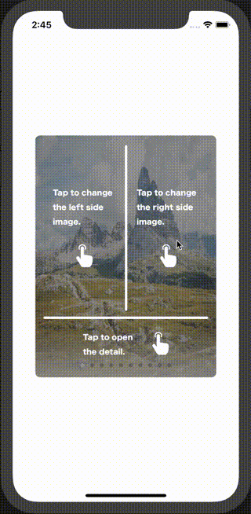
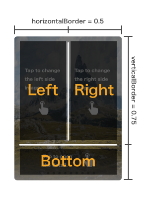

# TapCardView
UIView to detect a tap position.
If you do customize, Tinder like card UI is a possible.

TapCardView is to detect a tap position as left, right, bottom.
And a flip animation is a possible.

[](https://github.com/Carthage/Carthage)
[](http://cocoapods.org/pods/DataSources)
[](http://cocoapods.org/pods/TapCardView)
 
 [](https://www.apple.com/nl/ios/)

# OverView


# Install

### Carthage
For installing with Carthage, add it to your Cartfile.

```
github "shima11/TapCardView"
```

Do this command with terminal.

```
$ carthage update
```

Then, You need to add `TapCardView.framework` to your project.

### CocoaPods

For installing with CocoaPods, add it to your Podfile.

```
pod "TapCardView"
```

Do this command with terminal.

```
$ pod update
```

# Usage

TapCarView is devides Tap position into left, right, bottom.
`horizontalBorder` of property decides horizontal border of Tap position.
`verticalBorder` of property decides vertical border of Tap position.



## Basic
The basic usage is as follows.

```
class ViewController: UIViewController {

  override func viewDidLoad() {
      super.viewDidLoad()

      let frame = CGRect(x:100, y:100, width:300, height:400)
      let cardView = TapCardView(frame: frame)
      cardView.delegate = self
      view.addSubView(cardView)
    }
}

extension ViewController: CardViewDelegate {

    func tapPosition(type: TapPosition, sender: TapCardView) {

        print(type)

        switch type {
        case .left:
            break
        case .right:
            break
        case .bottom:
            break
        }
    }
}
```

## Customization
If you do customize like `Demo/CustomTapCardView`, Tinder like card UI is a possible.

# Licence

Licence MIT
